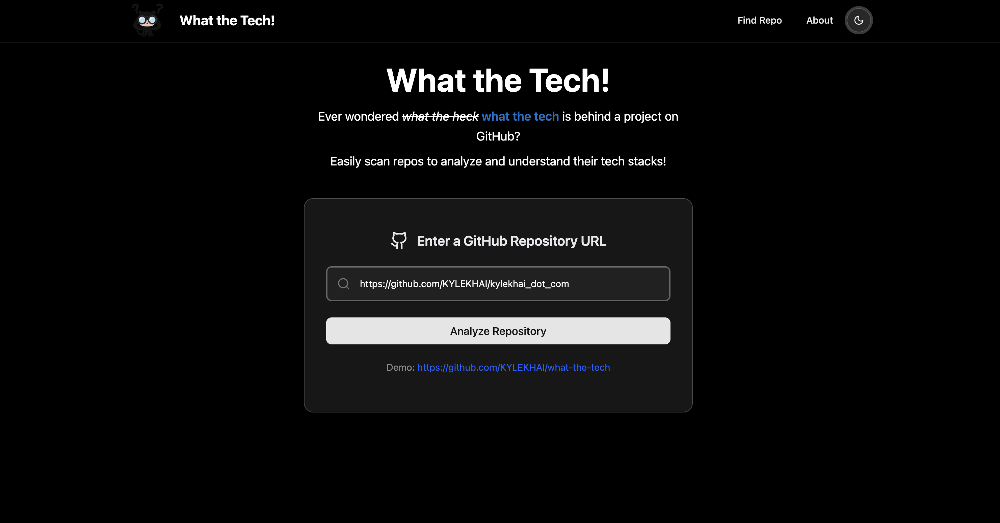
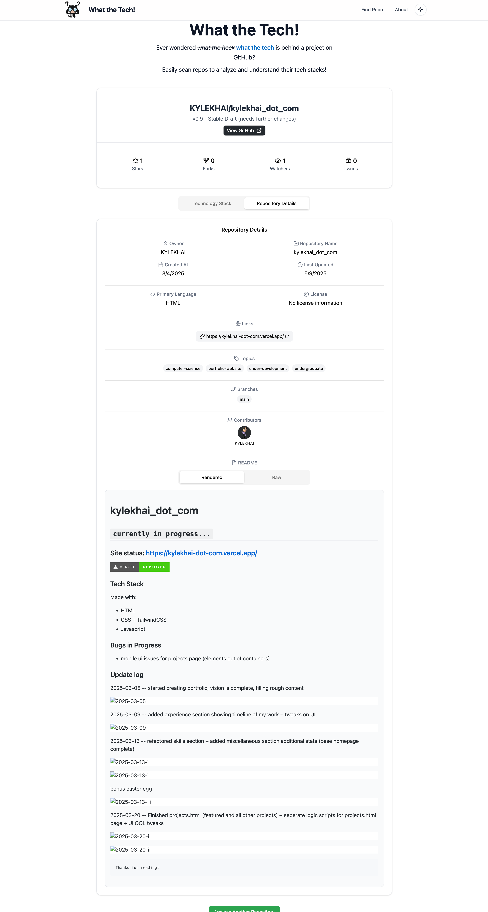

# what the tech!

`currently in development...`

A web-based tool to decode any GitHub repository:

- Identifies the complete tech stack used
- Provides AI insights into how each technology contributes to the project

---

## Preview

 
 

